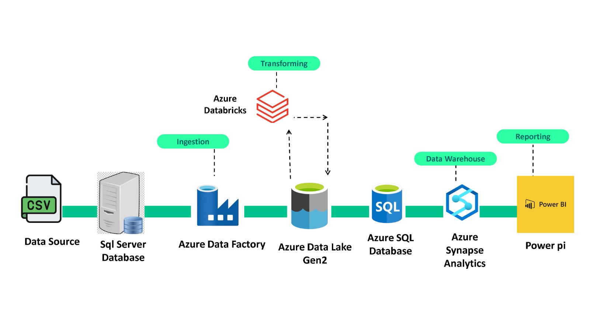
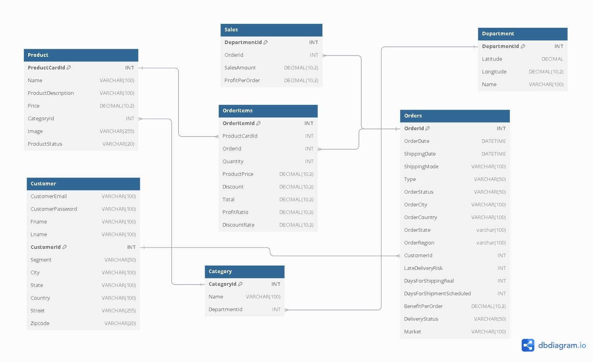
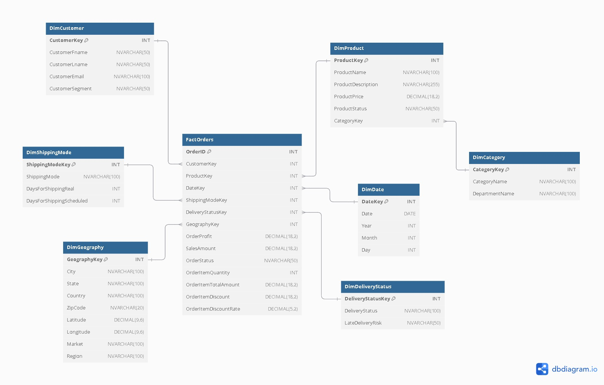
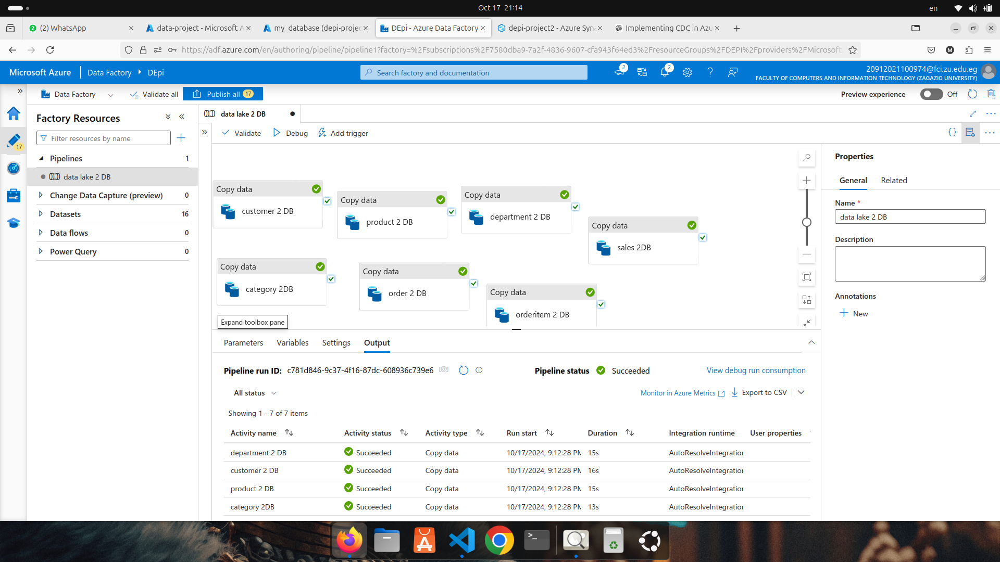
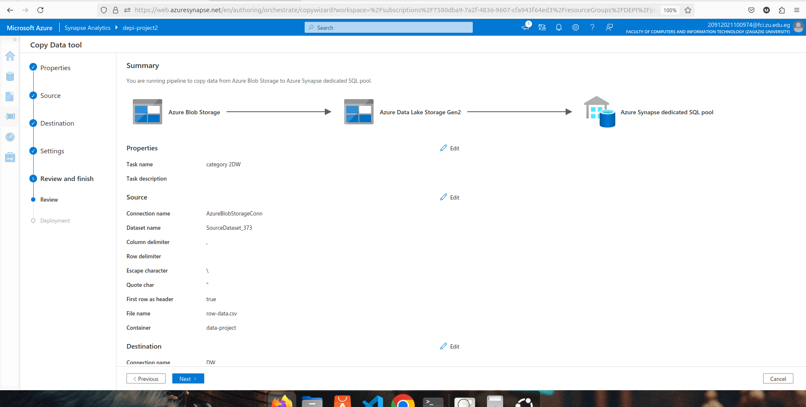
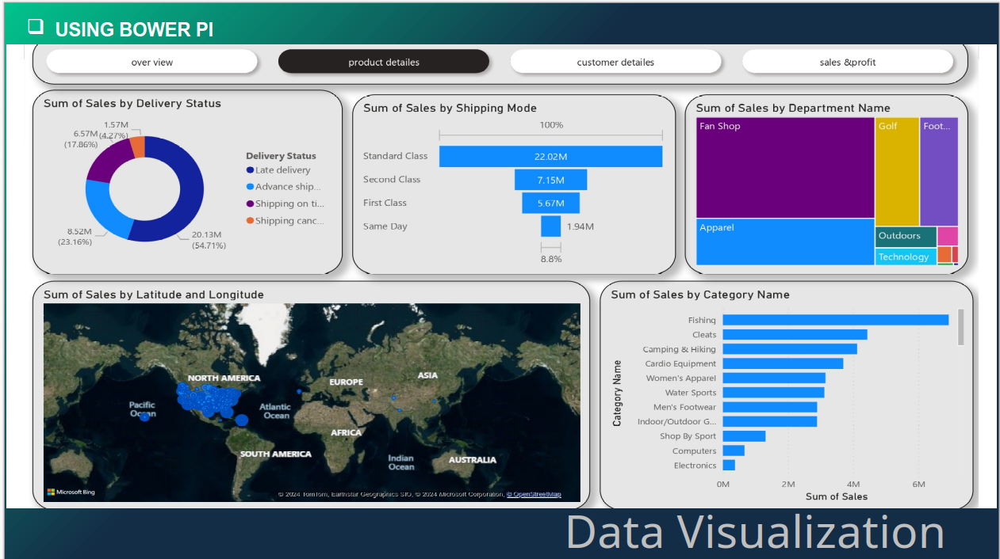

# Project Title: Supply Chain Data Integration and Reporting Using Azure

## Overview
This project demonstrates a robust ETL pipeline and data integration solution for managing a supply chain's data. It ingests data from multiple sources into an Azure SQL Database and an Azure Synapse Data Warehouse, using Azure Data Factory (ADF) for data orchestration. The final reporting is done through Power BI to deliver real-time business insights on the supply chain’s performance, including order processing, customer demographics, and product sales analysis.

The project covers three essential steps:
1. **Data Ingestion** from multiple sources into Azure Data Lake.
2. **Data Transformation and Loading** into both Azure SQL Database and Azure Synapse Analytics (Data Warehouse).
3. **Data Reporting** using Power BI.

## Project Architecture

The diagram above outlines the overall architecture of the project, including data flow from raw data sources (CSV or databases) through Azure Data Factory and Azure Data Lake, ending with Azure SQL Database and Azure Synapse for final storage and analysis.

## Data Models and Schemas

The project utilizes the following database schema to support the data analysis process:

### SQL Server Schema

This schema represents the core tables used for capturing order, customer, product, and department data. The tables are designed to track transactions, customer demographics, product details, and shipping information.

### Data Warehouse Schema

The Data Warehouse schema, as shown, follows a star-schema design, focusing on dimensional modeling. It includes key dimensions like Customer, Product, Shipping Mode, Geography, and more, which are linked to the central FactOrders table for analytical querying.

## Project Steps

### 1. Data Ingestion to Azure SQL Database
Using **Azure Data Factory (ADF)**, we ingest raw data from different sources (e.g., CSV files, on-premises databases) into the Azure Data Lake. The ingested data is cleaned and transformed before being loaded into the **Azure SQL Database**.
   

**Key Steps:**
- **Source Data**: CSV or SQL server databases.
- **Azure Data Lake Storage (Gen 2)**: Used as the staging area for raw data.
- **Transformation**: Data cleaning and minor transformation (if necessary) are done using Data Flows in ADF.
- **Ingestion**: Data is loaded into an **Azure SQL Database**, which is used for further transactional querying and data processing.

### 2. Data Ingestion to Azure Synapse Data Warehouse
The **Azure Synapse Data Warehouse** serves as the analytical engine. In this step, raw or minimally processed data from Azure Data Lake is transformed and loaded into the Synapse Warehouse for advanced reporting.
   

**Key Steps:**
- **Source Data**: Data in Azure Data Lake (possibly after minimal transformations).
- **Azure Synapse**: Serving as the data warehouse with optimized storage for analytical queries.
- **Transformation**: Performed using ADF or Databricks for data processing.
- **Data Load**: Final processed data is loaded into dimension and fact tables in Synapse for business intelligence and reporting.

### 3. Data Reporting with Power BI
The reporting layer is handled using **Power BI**, where insights and dashboards are built by connecting to both **Azure SQL Database** and **Azure Synapse Analytics**.
- Power BI provides real-time, interactive visualizations, covering key metrics like order status, customer segmentation, product performance, and shipping efficiency.

## Technologies Used
- **Azure SQL Database**: For transactional data storage and querying.
- **Azure Data Factory (ADF)**: For orchestrating data flows from source to destination.
- **Azure Data Lake Storage (Gen 2)**: Staging and storing raw data for processing.
- **Azure Synapse Analytics**: For data warehousing and large-scale analytics.
- **Power BI**: For data visualization and business reporting.

## Getting Started

### Prerequisites
1. Azure subscription with access to **Azure SQL Database**, **Azure Data Lake**, and **Azure Synapse**.
2. Basic knowledge of **SQL**, **Azure Data Factory**, and **Power BI**.

### Installation & Setup
1. Clone this repository to your local machine.
2. Configure your **Azure Data Factory** instance and create linked services for your data sources.
3. Deploy the database schema scripts for both SQL Database and Synapse Warehouse (scripts provided in the repository).
4. Use **Power BI** to import data from Azure and configure your reports.

## Conclusion
This project is a comprehensive demonstration of building a scalable ETL and reporting pipeline using Microsoft Azure’s ecosystem. It leverages cloud data services to ingest, transform, and store data effectively for reporting and analytics.
